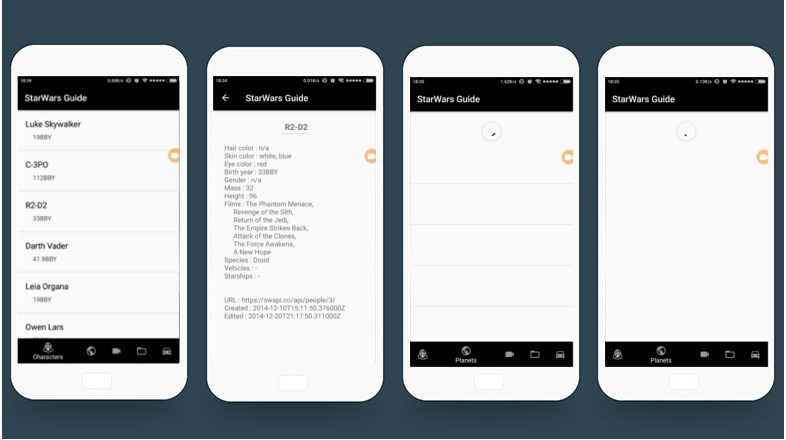
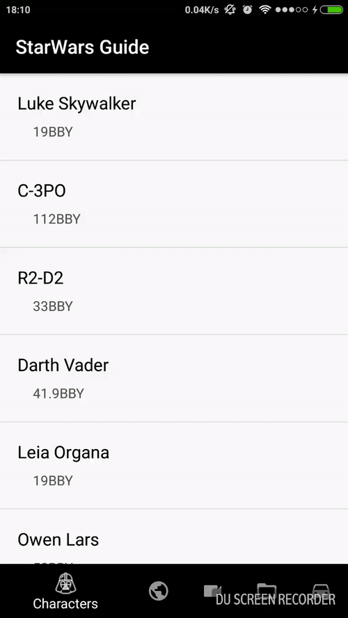

<h1 align="center"><b>StarWars-Guide</b></h1>
<h3 align="center">Android list-details app. Used API: https://swapi.co/</h3>

## Description

It's something like reference book of StarWars world, represented by following categories :
* Peoples
* Planets
* Films
* Species
* Vehicles

	

